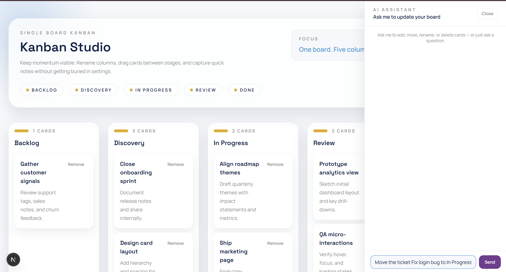

# Kanban Studio



A single-board Kanban app with an AI assistant that can add, move, rename, and delete cards on command.

**Stack:** FastAPI · SQLite · Next.js · dnd-kit · OpenAI

---

## Get started

**Dev — one command (Windows)**
```
scripts\dev.bat
```
Opens two terminal windows (backend + frontend) with hot reload.

**Dev — manual**
```bash
# terminal 1 — backend (port 8001)
cd backend
uv run uvicorn main:app --reload --port 8001

# terminal 2 — frontend (port 3000)
cd frontend
pnpm dev
```

Frontend → http://localhost:3000  
Backend → http://localhost:8001

**Production** (single container)
```
docker compose up --build
```
App → http://localhost:8000

Default credentials: `user` / `password`

---

## Features

- **Drag & drop** cards across five columns
- **Inline rename** columns (saved on blur)
- **AI sidebar** — describe what you want in plain English and the board updates instantly. The AI understands context (your current columns and cards) and can create cards, move them between columns, rename them, or delete them — all in one message. Powered by GPT-4o mini with structured outputs so mutations are applied directly, no copy-pasting required.
- **Persistent** — SQLite on disk, survives restarts

---

## Project structure

```
backend/    FastAPI app, SQLite, OpenAI integration
frontend/   Next.js app with Tailwind + dnd-kit
scripts/    dev.bat — starts everything locally
docs/       schema and planning docs
```

---

## Environment

Create a `.env` at the project root:
```
OPENAI_API_KEY=sk-...
```
